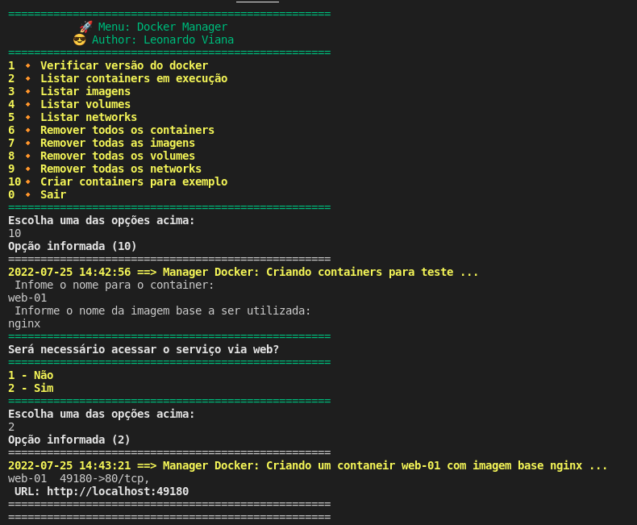

<h1 align="center">Manager Docker - Shell Script </h1>

<p align="center">
  
  
  
</p>

<p align="center">
  
</p>

## Projeto
- Projetinho para gerenciamento de containers `docker`, com o fim de praticar `shellscript` 

## Tools
- docker
- shell

## Execução
```bash
sudo bash main.sh
```

